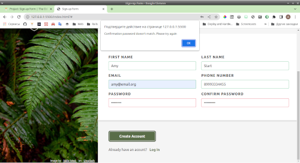
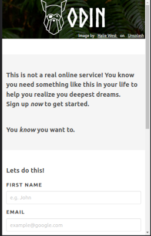

# sign-up-form
Task for [Odin Project](https://www.theodinproject.com/lessons/intermediate-html-and-css-sign-up-form) to replicate a particular sign up page *(look up in attached sign-up-form.png file)*

**Done using [Bulma](https://bulma.io/) framework**

[**Live Demo Link**](anutka777.github.io/sign-up-form)

Features:
 - Full responsiveness
 - Front-end form validations with visual effects
 - Script that checks password and password confirmation matching

